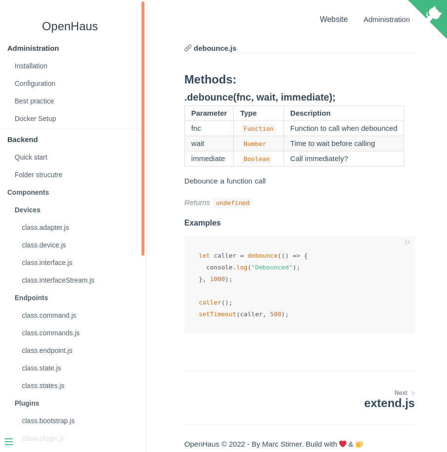

# Documentation
Documentation about Frontend, Backend, Connector, Installation &amp; Administration.<br />
The intent of this documentation is to give you a great over all introduction about OpenHaus.

https://docs.open-haus.io

# Description
This repo containes files where the documentaiton is generated via https://docsify.js.org.
Long story short, i could find a documentation tool that matches my needs. So i searched around and put something custom together.
Basicly we download the uncrompressed source code and parse the comments in it.
Then a template is filled with the harvested data and for each file a markdown output is generated. 
The markdown file can then be used in docsify. et voilà: Autogenerated documentaiton from source code.

# Important note
If you want to improve the docs, you have do modifie the source code of the following parts:
- [backend](https://github.com/OpenHausIO/backend)
- [frontend](https://github.com/OpenHausIO/frontend)
- [connector](https://github.com/OpenHausIO/connector)

The only execption are the "Administration" section.<br />
Please follow the order of tags and how they are used.<br />
See [How to document the source code](#how-to-document-the-source-code) below.

# First impression


# Contribute
Any contribuation is welcomed. Dont know where to start? Open a issue and start asking. This is not limited to the documention, klick on the Organization and start looking arround.<br />
Any help is appreciated. Dosnt matter how small or big.

# How to document the source code
There are 2 main block of comments. `class` & `functions`.
```js
/**
 * @class foo
 */
```

```js
/**
 * @function bar
 */
```

This code can be anywhere in the file you want to document.<br />
To add a description to a class, use `@description` tag:
```js
/**
 * @description
 * Descriopt goes here
 * 
 * @class callsName
 */
```
For a function you can write the description directly under the `@function` tag:
```js
/**
 * @function fnc
 * Description goes here
 */
```

To document parameter & propertys, use the `@param` and `@property` tags.
```js
/**
 * @description
 * This is to demonstrate the documentation<br />
 * You can use multiple line breaks or even <br />
 * [markdown](example.com) in it.
 * 
 * @class myClass
 * @extends Array https://example.com
 * 
 */
class myClass{

    constructor(prop1, prop2){
        this.prop1 = prop1;
        this.prop2 = prop2;
        this.timestamp = Date.now();
    }

    /**
     * @function method
     * This function returns the passed object
     * 
     * @param {Object} param1 Any object type you want
     * 
     * @returns {Object} input object
     */
    method(param1){
        return {...param1};
    }

}
```

Above you can see how to document a class with methods.<br />
As well you can see that we `extend` the Array super class.
The `@extends` tag support links to other documentation: Either a full link, or a internal link, e.g: `system/component/class.base.js`

# Supported tags
| Tag         | Description                                               |
| :---------- | :-------------------------------------------------------- |
| `@class`    | Declares the comment block as a class description         |
| `@property` | Defines a class property                                  |
| `@param`    | Defines a constructor/function parameter                  |
| `@function` | Declares the comment block as function/method description |
| `@extends`  | Indicates that a class extends some other class           |
| `@see`      | Internal link to some other file/documentation            |
| `@link`     | External link to something                                |
| `@returns`  | Describe what a function returns                          |
| `@emits`    | Events are documented                                     |
| `@example`  | Document example code                                     |

For a better understanding, take a look on the jsdoc specification: https://jsdoc.app

### Tag order
```js
/**
 * @description
 * The description goes first! 
 * For classes only, if you define a function, 
 * use the @function tag instead and skip the description tag
 * 
 * @class name After the description tag, comes the class tag
 * @extends Array optional extends tag, directly after the class tag
 * 
 * @param {Object} obj Then parameter are document
 * 
 * @property {Array} items Then propertys
 * 
 * @emits What ever is emitted
 * 
 * @example 
 * ```js
 * ...
 * ```
 * 
 * @returns {String} If you document a function, this is the place where the return tag is used
 * 
 * @see As last items
 * @link are links documented
 */
```

1. Description/Function
2. Class
3. Extends
4. Parameter
5. Propertys
6. Events
7. Examples
8. Return Value
9. Additional links

This order helps to keep a consistent documentation of the source code.