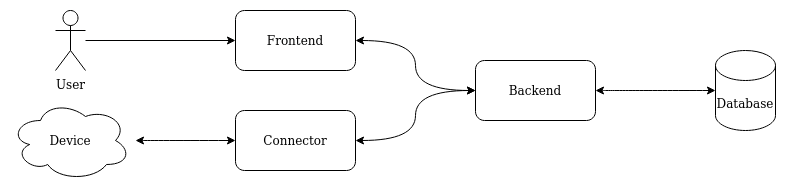

# Introduction

Welcome to the OpenHaus documentation site. 
This page will describe how to install the OpenHaus eco system and how to administrate it. 

OpenHaus consists of diffrent parts, where each has a special purpose:
- [backend](https://github.com/OpenHausIO/backend) (Provides a API, handle commands & states and store items in the database)
- [frontend](https://github.com/OpenHausIO/frontend) (User interface for interaction with the backend)
- [connector](https://github.com/OpenHausIO/connector) (Connection between your local network (LAN) and the backend)

For a better illustarting, take a look on the graphic below:

If you want do administrate it, jump to the [administration](administration/installation) page. 
When you inerested in developing plugins or improve the backend take a look into the [backend](backend/quick-start) section.

If you need help or just want to chat, do not hesitate to contact us.