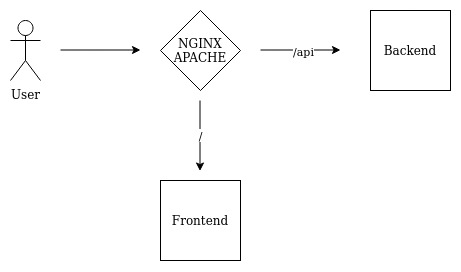

# Best practice guide


#### Running the backend behind nginx
Visual representation


1) Install the nginx webserver
```bash
yum install nginx -y
```

2) Create a nginx configuration file `/etc/nginx/conf.d/open-haus.conf`:
```nginx
server {

    listen 80;
    server_name 127.0.0.1 localhost open-haus.lan open-haus.local;

    # remove server version
    server_tokens off;

    root /opt/OpenHaus/frontend;

    try_files $uri $uri/ =404;
    index index.html;

    autoindex off;

    location = /favicon.ico { access_log off; log_not_found off; }
    location = /robots.txt  { access_log off; log_not_found off; }

    location ~ ^/(api|auth)/ {
        proxy_pass http://127.0.0.1:8080/;
        proxy_http_version 1.1;
        proxy_set_header X-Forwarded-Proto $scheme;
        proxy_set_header Connection $connection_upgrade;
        proxy_set_header Upgrade $http_upgrade;
        proxy_set_header Host $host;
        proxy_set_header X-Real-IP $remote_addr;
        proxy_set_header X-Forwarded-For $proxy_add_x_forwarded_for;
    }
}
```

!> Be sure to create the root folder `/opt/OpenHaus/frontend` if you dont serve the frontend<br />
This is not neccesary if you symlink the latest version of the frontend (Analog to the backend installation process)

1) Enable autostart
```bash
systemctl enable --now nginx
systemctl status nginx
```

4) Test the configuration
```bash
curl -v http://127.0.0.1
```